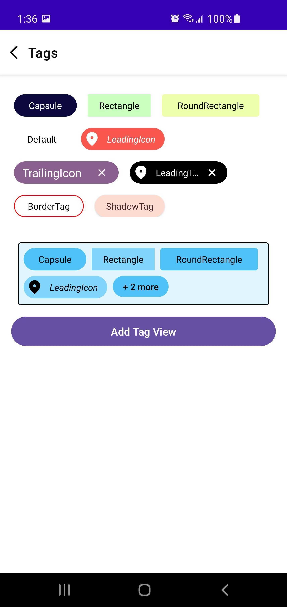

# AndroidYCoreUI
==================

## Y Tags
==================

Y Tag is a UI element in Android (some times referred to as chips) which displays a piece of
information.
It consist of a leading icon(optional), Text and a trailing icon (optional).

### Features
==================

- Fully customizable
  - Shape
  - Leading and Trailing Icons
  - Border
  - Background
  - Text style
  - Shadow
- Provides a container called Tag view container which holds multiple tags
  - Container size can be fixed or variable
  - If container does not have enough space to accommodate the given tags, it will show over flow
    tag which is configurable.
- Built with Compose UI

### Usage
==================

**Basic**

```
TagView(text ="Default")
```

**Customizations**

```
val text = "Y Tag"
val tagViewModifiers = TagViewModifiers.Builder()
    .width(140.dp)
    .shape(CircleShape)
    .backgroundColor(backgroundColor)
    .enableBorder(true)
    .borderColor(Color.Red)
    .textColor(Color.Black)
    .maxLines(1)
    .overFlow(TextOverflow.Ellipsis)
    .build()
val leadingIcon =  { tagViewData ->
    IconButton(
       onClick = {}) {
       Icon(painter = painterResource(id = R.drawable.ic_location_24px),
            contentDescription = null,
            tint = iconTint
        )
      }
    }   
    
val trailingIcon =  { tagViewData ->
    IconButton(
       onClick = {}) {
       Icon(painter = painterResource(id = R.drawable.ic_close_20px),
            contentDescription = null,
            tint = iconTint
        )
      }
    }     
    
TagView(text = text,  tagViewModifiers = tagViewModifiers, leadingIcon = leadingIcon, trailingIcon = trailingIcon,  enabled = true)
```

** Y Tag Container **

```
 val tagViewData = remember {
        mutableStateListOf<TagViewData>()
    }
    
   tagViewData.addAll(   
   TagViewData(
        text = "capsule",
        tagViewModifiers = TagViewModifiers.Builder()
        .width(90.dp)
        .shape(CircleShape)
        .backgroundColor(backgroundColor).textColor(textColor).style(textStyle).build()
    ))
    
  val tagViewContainerModifiers = TagViewContainerModifiers.Builder()
      .shape(RoundedCornerShape(4.dp)
      .tagSpacingVertical(8.dp)
      .tagSpacingHorizontal(8.dp)
      .width(360.dp)
      .height(50.dp)
      .moreTagConfiguration(
       TagViewData(
           overFlowText = { count ->
              "+ $count more"
           },
           tagViewModifiers = TagViewModifiers.Builder()
              .backgroundColor(colorResource(id = R.color.light_blue_300))
               .shape(CircleShape).width(80.dp).textAlign(TextAlign.Start).height(30.dp)
               .maxLines(1).overFlow(TextOverflow.Ellipsis).textAlign(TextAlign.Center)
               .textColor(Color.Black).fontWeight(FontWeight.Medium).onCLick { }.build()
              )
     ).onCLick {}
     .build()
     
    TagViewContainer(tagViewData = tagViewData, tagViewContainerModifiers = tagViewContainerModifiers)  
```

### Screenshots




### How to generate test report

- Generating jacoco test report
  - Gradle command `clean build createMergedJacocoReport`
    - From android studio
      - Open gradle menu bar from android studio right side panel
      - Click on the gradle icon and
      - In command popup window type `clean build createMergedJacocoReport` and press enter
      - Wait for the execution completion,
      - After successful execution each module level execution report will be stored in '
        module\build\reports\jacoco\html\index.html'.

### How to generate dokka report

- Gradle command single module `clean build dokkaHtml` for multi
  module `clean build dokkaHtmlMultiModule`
  - From android studio
  - Open gradle menu bar from android studio right side panel
  - Click on the gradle icon and
  - In command popup window type `dokkaHtml` for multi module `dokkaHtmlMultiModule`

### How to check KTLint

- Gradle command for checking lint error `ktlintCheck`
- Gradle command for formatting code `ktlintFormat`
  =======


